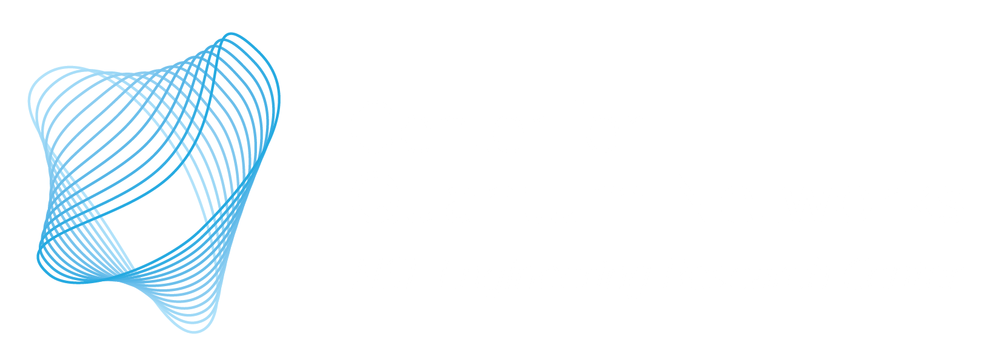

## Welcome to the first Quantum Information Knowledge (QuIK) workshop, which will be held in Athens, Greece, during ISIT 2024!

<figure>
  

    
	
  

</figure>       

<h3> 
The Quantum Information Knowledge (QuIK) workshop will be held as part of the <a href="https://2024.ieee-isit.org">IEEE International Symposium on Information Theory (ISIT) 2024</a>, the flagship conference of the <a href="https://www.itsoc.org/">IEEE Information Theory Society</a>. The long-term vision for this workshop is to establish a platform at ISIT for active discussions on problems in quantum information. The goal of this first edition of the workshop is to provide foundational knowledge in quantum error correction (QEC) for fault-tolerant quantum computing (FTQC), complement that with exciting talks by invited speakers working in this area, foster discussions on key open problems, both foundational and practical ones, and discuss some of the latest results in the field. 
</h3>

## Mailing List:
<h3>
We have created a mailing list for this workshop to send updates. To join the mailing list, <a href="mailto:list@list.arizona.edu?subject=subscribe%20isit-quik24%20firstname%20lastname&body=%20">click here</a> to auto-compose the e-mail, but replace "firstname" and "lastname" in the subject line to your first name and last name respectively (leave the message body blank). In case the link doesn't work, please send an e-mail to <a href="mailto:list@list.arizona.edu">list@list.arizona.edu</a> with an empty message body and the subject 'subscribe isit-quik24 firstname lastname' (ignore the quotes and replace placeholders with your first and last names). If you do not receive a welcome message from the list within 30 minutes, please contact us (see bottom of this page).
</h3>

## Tentative Schedule:
<h3> 
The workshop starts with a tutorial introducing fundamental concepts in QEC and FTQC, targeted at an audience with background in classical coding theory. No prior familiarity with quantum mechanics or quantum computing is assumed. The tutorial will be followed by invited talks by various well-known researchers who are pushing the boundaries of QEC and FTQC. The workshop will end with a panel discussion involving the invited speakers and a poster session based on novel research work and key open problems in FTQC.  
</h3>

<table style="width:80%">
  <tr style="background-color: #F28C28">
    <th>Time</th>
    <th>Event</th>
  </tr>
  <tr>
    <td> 09:00 - 10:00</td>
    <td>Tutorial on Quantum Error Correction and Fault-Tolerance</td>
  </tr>
  <tr>
    <td>10:00 - 10:50</td>
    <td>Keynote Talk: Liang Jiang</td>
  </tr>
  <tr style="background-color: #F28C28">
    <td>10:50 - 11:00</td>
    <td>Break</td>
  </tr>
  <tr>
    <td>11:00 - 11:25</td>
    <td>Invited Talk 1: Valentin Savin</td>
  </tr>
  <tr>
    <td>11:25 - 11:50</td>
    <td>Invited Talk 2: Nithin Raveendran</td>
  </tr>
  <tr>
    <td>11:50 - 12:15</td>
    <td>Invited Talk 3: Priya J. Nadkarni</td>
  </tr>
  <tr style="background-color: #F28C28">
    <td>12:15 - 13:15</td>
    <td>Lunch Break</td>
  </tr>
  <tr>
    <td>13:15 - 13:40</td>
    <td>Invited Talk 4: Anirudh Krishna</td>
  </tr>
  <tr>
    <td>13:40 - 14:05</td>
    <td>Invited Talk 5: Armanda O. Quintavalle</td>
  </tr>
  <tr style="background-color: #F28C28">
    <td>14:05 - 14:10</td>
    <td>Break</td>
  </tr>
  <tr>
    <td>14:10 - 14:35</td>
    <td>Invited Talk 6: Gretchen Matthews</td>
  </tr>
  <tr>
    <td>14:35 - 15:00</td>
    <td>Invited Talk 7: Shayan Srinivasa Garani</td>
  </tr>
  <tr style="background-color: #F28C28">
    <td>15:00 - 15:15</td>
    <td>Snack Break</td>
  </tr>
    <tr>
    <td>15:15 - 16:00</td>
    <td>Panel Discussion</td>
  </tr>
  <tr>
    <td>16:00 - 17:00</td>
    <td>Poster Session</td>
  </tr>
</table>

## Topics of the Workshop:
<h3>
The tutorial, presentations, and discussions in this workshop would cover a broad range of research topics in FTQC, including but not limited to the following:  
 
  <ul>
	<li>Quantum error correction codes for quantum computing</li>
	<li>Qubit/qudit decoding techniques and their implementation</li>
	<li>FTQC approaches, e.g., Measurement Based Quantum Computing (MBQC), Foliated codes, Floquet codes</li>
	<li>FT logical gates and logical operator measurements</li>
	<li>FTQC architectures</li>
	<li>Bosonic codes and their decoding techniques</li>
	<li>Fault-tolerance for specific algorithms, including overhead estimates, scaling laws of logical error rates, etc.</li>
  </ul>
</h3>
<!-- end of the list -->

## Workshop date and venue:
<h3> 
Full-day workshop (in-person) on July 7, 2024 (Sunday) in room <a href="https://cmsworkshops.com/ISIT2024/technical_program.php"> Ypsilon I-II-III </a> of Athenaeum Intercontinental Athens
</h3>

## Invited Speakers List:
<h3> 
Invited talks by fault-tolerant quantum computing experts from different backgrounds such as physics, mathematics, electrical engineering, computer science, etc., are planned to cater different perspectives of this interdisciplinary field to the audience. The finalized invited speakers and talk details are below:  
 
  <ul>
	<li>Liang Jiang, University of Chicago, Chicago, USA (Keynote)</li>
	
	<h4>
	Title: Co-Designed Quantum Error Correction  
	 
	
	Abstract: To effectively address practical imperfections while harnessing the power of quantum information processing, our goal is to design quantum error correction schemes that can not only suppress dominant errors specific to particular hardware but also meet the requirements of various applications. I will discuss the process of designing quantum error-correcting codes that can optimally suppress practically relevant errors, with examples of custom-designed quantum error correction schemes that can efficiently correct practically relevant errors in AMO and solid-state platforms. I will also explore quantum error-correcting codes designed for various applications in quantum computing, communication, and sensing.  
	 
	
	Bio: Liang Jiang is a professor in the Pritzker School of Molecular Engineering at the University of Chicago. Jiang received his BS from Caltech in 2004 and PhD from Harvard University in 2009. He was a faculty member at Yale University during 2012-2019. His research focuses on using quantum control and error correction to build large scalable quantum systems. Jiang is a Fellow of the American Physical Society and also a recipient of the Sloan Research Fellowship, the David and Lucile Packard Foundation Fellowship, and the APS Landauer-Bennett Award.
	</h4>
	
	
	
	
    <li>Valentin Savin, Université Grenoble Alpes, CEA-Léti, Grenoble, France</li>
	
	<h4>
	Title: On the Decoding Radius of Message Passing Decoders for the Toric Code  
	 
	
	Abstract: Kitaev’s toric code is one of the most prominent models for fault-tolerant quantum computation, currently regarded as the leading solution for connectivity constrained quantum technologies. Significant effort has been recently devoted to improving the error correction performance of the toric code under message-passing decoding, a class of low-complexity, iterative decoding algorithms that play a central role in both theory and practice of classical low-density parity-check codes. Here, we provide a theoretical analysis of the toric code under min-sum (MS) decoding, a message-passing decoding algorithm known to solve the maximum-likelihood decoding problem in a localized manner, for codes defined by acyclic graphs. Our analysis reveals an intrinsic limitation of the toric code, which confines the propagation of local information during the message-passing process. We show that if the unsatisfied checks of an error syndrome are at distance at least five from each other, then the MS decoding is locally blind: at no iteration, the qubits in the direct neighbor of an unsatisfied check are aware of other unsatisfied checks.  Moreover, we show that degeneracy is not the only cause of decoding failures for errors of weight at least four, that is, the MS non-degenerate decoding radius is equal to 3, for any toric code of  distance at least 7. Finally, complementing our theoretical analysis, we present a pre-processing method of practical relevance. The proposed method, referred to as stabilizer-blowup, has linear complexity and allows correcting all (degenerate) errors of weight up to 3, thus providing quadratic improvement in the logical error rate performance, as compared to MS only.  
	 
	Joint work with Julien Du Crest (UGA, LIG) and Mehdi Mhalla (UGA, CNRS, LIG)  
	 
	
	Bio: Valentin Savin is a Senior Researcher at CEA-LETI, Grenoble, France. He received the PhD degree in mathematics from Joseph Fourier University, Grenoble, in 2001. From 2002 to 2004, he was a Post-Doctoral Researcher with the Institute of Mathematics of the Romanian Academy. Since 2005, he has been with CEA-LETI, first as a two-year Post-Doctoral Researcher, and then as a Permanent Researcher. His main research interests are in the area of classical and quantum error correction, for reliable communication and fault-tolerant information storage and processing. Over the last years, he has been actively involved in the definition, implementation, and coordination of several French and European collaborative research projects on the analysis and design of iterative decoders running on faulty hardware, the design of fault-tolerant circuits from unreliable components, and advanced error correction techniques for quantum information processing. He has authored more than 100 publications and peer-reviewed international journals and conference proceedings.
	</h4>
	
	
	
	
	<li>Nithin Raveendran, University of Arizona, Tucson, USA</li>
	
	<h4>
	Title: Trapping Sets of QLDPC Codes Under Iterative Decoding  
	 
	
	Abstract: Recent developments in quantum hardware technologies have enabled strategic implementation of good quantum low-density parity-check (QLDPC) codes. Unlike classical LDPC codes, the decoding performance of such QLDPC codes under iterative decoding is extremely poor. Using careful analysis of these decoding failures, one can identify the presence of trapping sets – small subgraphs that cause iterative decoding to not converge and result in the decoder error. It is imperative that to improve decoding performance significantly at low-latency constraints, one should enumerate, analyze, and annihilate these trapping sets. From this talk, one will understand what these quantum trapping sets are, where and why iterative decoders such as belief propagation fail for QLDPC codes, as well as how to make them better without using highly complex post-processing steps such as the ordered statistics decoder as the remedy.  
	 
	
	Bio: Nithin Raveendran is an Assistant Research Professor at the Electrical and Computer Engineering department at the University of Arizona. His current area of research is broadly on quantum computation and communication, with a focus on quantum error correction on developing improved quantum error correction codes and best-performing iterative decoders. He earned his Ph.D. degree on the topic of trapping sets of classical and quantum low-density parity-check codes at the University of Arizona. Prior to his Ph.D., he earned his master's degree at the Department of Electronic Systems Engineering (DESE), Indian Institute of Science (IISc), Bangalore, and his undergraduate degree in Electrical and Electronics Engineering at BITS Pilani. His recent journal and conference publications can be accessed on <a href="https://scholar.google.com/citations?hl=en&user=FBrIdeAAAAAJ">Google Scholar</a>.
	</h4>
	
	
	
	
	<li>Priya J. Nadkarni, Xanadu Quantum Technologies, Toronto, Canada</li>
	
	<h4>
	Title: Photonic fault-tolerant quantum computing based on concatenated GKP-quantum LDPC codes  
	 
	
	Abstract: In this talk, I will present Xanadu's scalable photonic fault-tolerant quantum computing architecture that uses the bosonic Gottesman-Kitaev-Preskill (GKP) code concatenated with a quantum low-density parity check (LDPC) code, that can be realized using static linear optical elements. I will discuss the quantum optical circuits designed to build the quantum computer and the mathematical equivalence between these quantum optical circuits and the qubit-level computational resource state. Finally, I will link the problems relevant to the embedded quantum error correction codes to well-studied techniques in classical error correction.  
	 
	
	Bio: Priya J. Nadkarni received her B.E. in electronics and communication engineering from the BMS College of Engineering, Bengaluru. She completed her M.Sc. and Ph.D. in Engineering at the Indian Institute of Science (IISc), Bengaluru, with a focus on entanglement-assisted additive qudit stabilizer codes and quantum distributed storage networks. She is currently a senior quantum architecture scientist at Xanadu designing various quantum error correction techniques for fault-tolerant photonic quantum computers based on bosonic qubits. Her research interests include quantum error correction codes, fault-tolerant quantum computation, quantum circuit architectures, quantum algorithms, and quantum communication. Her research work has been presented at various top-tier conferences and has been published in various top-tier journals. She has been a part of many executive committees at IEEE-IISc and is a HKN member.
	</h4>
	
	
	
	
	<li>Anirudh Krishna, IBM Quantum, Yorktown Heights, USA</li>
	
	<h4>
	Title: Tradeoffs between connectivity and codes  
	 
	
	Abstract: For quantum error-correcting codes to be realizable, it is important that the qubits subject to the code constraints exhibit some form of limited connectivity. The works of Bravyi & Terhal (BT) and Bravyi, Poulin & Terhal (BPT) established that geometric locality constrains code properties -- for instance \( [[ n,k,d ]] \) quantum codes defined by local checks on the \(D\)-dimensional lattice must obey \( \frac{kd^2}{D−1} \leq O(n) \). Baspin and Krishna studied the more general question of how the connectivity graph associated with a quantum code constrains the code parameters. These trade-offs apply to a richer class of codes compared to the BPT and BT bounds, which only capture geometrically-local codes. We extend and improve this work, establishing a tighter dimension-distance trade-off as a function of the size of separators in the connectivity graph. We also obtain a distance bound that covers all stabilizer codes with a particular separation profile, rather than only LDPC codes.  
	 

	 This talk is based on the following papers:  <a href="https://arxiv.org/abs/2106.00765">https://arxiv.org/abs/2106.00765</a> , <a href="https://arxiv.org/abs/2109.10982">https://arxiv.org/abs/2109.10982</a> , <a href="https://arxiv.org/abs/2307.03283">https://arxiv.org/abs/2307.03283</a> .  
	 
	
	Bio: Anirudh Krishna received his Ph.D.in physics  from the Université de Sherbrooke in 2020. He was a Bloch Postdoctoral Fellow at Stanford between 2020 and 2023. He is currently a Staff Research Scientist at IBM Quantum, Yorktown Heights. His research focuses on fault-tolerant quantum computation. He is primarily interested in the construction of efficient and scalable methods to perform quantum error correction.
	</h4>
	
	
	
	
	<li>Armanda O. Quintavalle, Freie Universität Berlin, Germany</li>
	
	<h4>
	Title: (Some) Logical operations on (some) LDPC codes  
	 
	
	Abstract: Error correction codes would be of no use without a method for dynamically manipulating the information they store. While the literature offers several techniques for performing gates on codes with just one logical qubit, there are far fewer solutions available for codes that encode multiple logical qubits. In this paper, we introduce an approach to implement logical encoded gates within hypergraph product codes, even for codes with multiple logical qubits. Our method extends the concept of transversal gates and relies on partitioning the physical qubits within the code in alignment with its logical structure. After demonstrating the fault tolerance of our method, we showcase its application in realizing certain Clifford gates for hypergraph product codes that adhere to specific symmetry constraints.  
	 
	
	Bio: Armanda Quintavalle received her PhD degree in quantum information theory from The University of Sheffield in 2022. She is currently a postdoctoral researcher at Freie Universität Berlin, where she works as the quantum error correction lead in AG Eisert's group.
	</h4>
	
	
	
	
	<li>Gretchen Matthews, Virginia Tech, Blacksburg, USA</li>
	
	<h4>
	Title: A characterization of binary CSS-T codes for quantum fault tolerance  
	 
	
	Abstract: CSS-T codes were recently introduced as quantum error-correcting codes that respect a transversal gate. In this talk, we provide an algebraic characterization for those pairs of binary linear codes that give rise to CSS-T codes and determine the maximal and minimal elements of the poset of CSS-T pairs. We apply these results to find cyclic and extended cyclic codes to obtain quantum codes with better parameters than those in the literature.  
	 

	 This is joint work with Eduardo Camps-Moreno, Hiram H. Lopez, Diego Ruano, Rodrigo San-Jose, And Ivan Soprunov.  
	 
	
	Bio: Gretchen Matthews is a Professor in the Department of Mathematics at Virginia Tech where she also serves as Director of a regional component of the Commonwealth Cyber Initiative (CCI) and leads the Applied Algebra Research Group. Matthews earned her B.S. from Oklahoma State University in 1995 and her Ph.D. in mathematics from Louisiana State University in 1999. In addition to her NSF-supported research program in applications of algebraic geometry and combinatorics to coding theory, she enjoys fostering inclusive research environments.
	</h4>
	
	
	
	
    <li>Shayan Srinivasa Garani, Indian Institute of Science, Bangalore, India</li>
	
	<h4>
	Title: Near-threshold Qudit Stabilizer Codes for Magic State Distillation  
	 
	
	Abstract: Magic state distillation is a protocol to purify noisy quantum states using quantum stabilizer codes. In this talk, I will discuss the conditions for identifying such magic states and show how the magic state distillation process converges in the quantum entropic sense. Analytical results will be presented to show the scaling of the noise threshold as a function of the minimum distance and the number of physical qubits of the underlying quantum stabilizer code. Examples of magic state distillation using near-threshold quantum stabilizer codes along with their encoding circuits will be discussed.  
	 

	This is a joint work with Abhi Kumar Sharma.  
	 
	
	Bio: <a href="https://labs.dese.iisc.ac.in/pnsil/">Shayan Srinivasa Garani</a> is a Faculty Member at IISc. Prior to joining IISc, he was leading various research activities, managing and directing research and external university research programs within Western Digital. He was the Chairman for signal processing for the IDEMA-ASTC and a co-chair for the overall technological committee, as well as past Chair for IEEE Data Storage Technical Committee. He holds more than 16 patents in data storage and was the key architect towards development of disruptive channels engineering solutions for HDDs and SSDs that went into products. His current research interests include the broad areas of physical data storage, quantum information processing, AI and music. Outside academics, he is Carnatic classical vocalist. 
	</h4>
	
	
	
	
  </ul>
</h3> 

## Call for Papers:
<h3> 
We invite interested authors to submit their previously unpublished work in the area of QEC/FTQC, including but not limited to the topics listed above. The paper should be tailored to an audience comprising engineers, mathematicians, and other researchers who are experts in classical coding and information theory. The accessibility of the paper to classical coding and information theorists would be a key criterion for acceptance of the paper. However, the results must necessarily address important questions in QEC/FTQC.  Take a quantum leap by submitting your paper on March 3rd, 2024 (11:59 PM anywhere in the world)! 
</h3>

<h4 style="color:#F28C28"> Paper Submission Details: </h4>
<h4> 
Submit your papers via <a href="https://openreview.net/group?id=IEEE.org/ISIT/2024/Workshop/QuIK">OpenReview</a>. In the field called "TL;DR", specify if it is a paper or poster submission. All papers must be formatted as per the requirements of a standard ISIT paper. Note the OpenReview moderation policy:  
 
  <ul>
    <li>New profiles created without an institutional email will go through a moderation process that can take up to two weeks </li>
	<li>New profiles created with an institutional email will be activated automatically </li>
  </ul>
  
Please click <a href="https://2024.ieee-isit.org/information-authors-0">here</a> for the website containing the information for authors such as paper format, template and example. Each paper will go through a rigorous review process. An author of an accepted paper must register and present a poster based on the paper at the workshop. The requirements of the poster will be communicated with the acceptance notification for the paper. Only the accepted papers that are presented as posters will be published on IEEE Xplore. Please note that these papers are not eligible for the Jack Keil Wolf ISIT Student Paper Award. 
</h4>

## Call for Posters:
<h3> 
We invite the submission of posters primarily concerning major challenges or open problems broadly in QEC for FTQC, including but not limited to the topics listed above for the workshop. The main goal of the poster session at this QuIK workshop is to foster stimulating discussions on this topic in the hope of achieving new collaborations between the attendees. Given this goal, the posters must be designed to interface well with classical information and coding theorists who are interested in learning about these challenges. We highly recommend submitting posters that clearly describe a challenge that can be quickly communicated in a short conversation with an attendee. It is better to refrain from discussing problems that are too deep, technically or otherwise, to understand in a short span of time. The review process for the posters will make this a key criterion for acceptance. 
 
Each poster will go through a rigorous review process. An author of an accepted poster must register and present it at the workshop. The accepted posters will not be published on IEEE Xplore. But we encourage the presenters to provide us with the digital versions of their posters so that they can be shared with the workshop attendees for later viewing.
</h3>

<h4 style="color:#F28C28"> Poster Submission Details: </h4>
<h4> 
Submit your posters via <a href="https://openreview.net/group?id=IEEE.org/ISIT/2024/Workshop/QuIK">OpenReview</a>. In the field called "TL;DR", specify if it is a paper or poster submission. Note the OpenReview moderation policy:  
 
  <ul>
    <li>New profiles created without an institutional email will go through a moderation process that can take up to two weeks </li>
	<li>New profiles created with an institutional email will be activated automatically </li>
  </ul>
  
To make your submission for a poster on an open problem, please write a 3-page extended abstract describing the challenge and the tentative contents of the poster. The font size must be at least 11 with reasonable margins. The page limit excludes references. This must not be a summary of a paper but an insightful description of a key problem in QEC for FTQC that is accessible to a classical information/coding theorist. The submission can be based on published work, but the poster must discuss an unsolved challenge related to that work and not just present the results of that work. In the abstract, also provide a rough sketch of how you intend to communicate the challenge in the poster format.
</h4> 

## Important Dates:
<h3>
Paper submission deadline:  <s>3rd March 2024</s>  <s>(11:59 PM anywhere in the world)</s>  
 
Poster submission deadline:  <s>17th March 2024</s>  <s>(11:59 PM anywhere in the world)</s>  
 
Acceptance notification:  <s>26th April 2024</s>  <s>(11:59 PM anywhere in the world)</s>  
 
Final manuscript submission:  <s>13th May 2024</s>  <s>(11:59 PM anywhere in the world)</s>  
 
Early registration deadline:  <s>13th May 2024</s>  <s>(11:59 PM anywhere in the world)</s>  
 
Online registration deadline:  <s>30th June 2024</s>  <s>(11:59 PM anywhere in the world)</s>  
 
After this date, you will need to register at the on-site registration desks at the convention venue starting July 6.
</h3> 

## Registration Details: 
<h3>
Please refer to the <a href="https://2024.ieee-isit.org/registration-0">ISIT 2024 website</a> for workshop registration. Some funds will be available to provide partial financial support to QEC/FTQC researchers who do not normally attend ISIT. We are excited about enabling fruitful interactions between the QEC/FTQC community and classical information/coding theorists!
</h3> 

## We look forward to seeing you at the workshop!

## QuIK'24 Program Chairs:
<h3>
Priya J. Nadkarni, Xanadu Quantum Technologies  
Narayanan Rengaswamy, University of Arizona  
Bane Vasić, University of Arizona
</h3>

<!--
## Frequently Asked Questions (FAQs):
<h3>
To be updated  
 
-->
<h3>
Questions? <a href="mailto:narayananr@arizona.edu?cc=priya@xanadu.ai; vasic@ece.arizona.edu&subject=QuIK%202024">E-mail Narayanan Rengaswamy with Cc to Priya Nadkarni and Bane Vasić</a>
</h3> 

<h4 style="text-align:center"> Webpage last updated: July 3, 2024 </h4>
